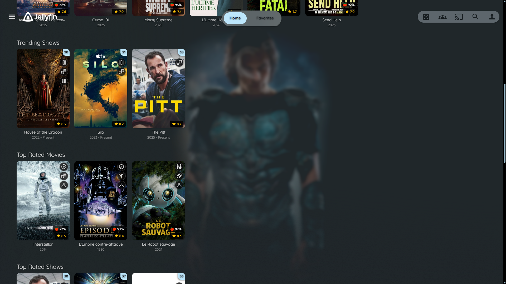
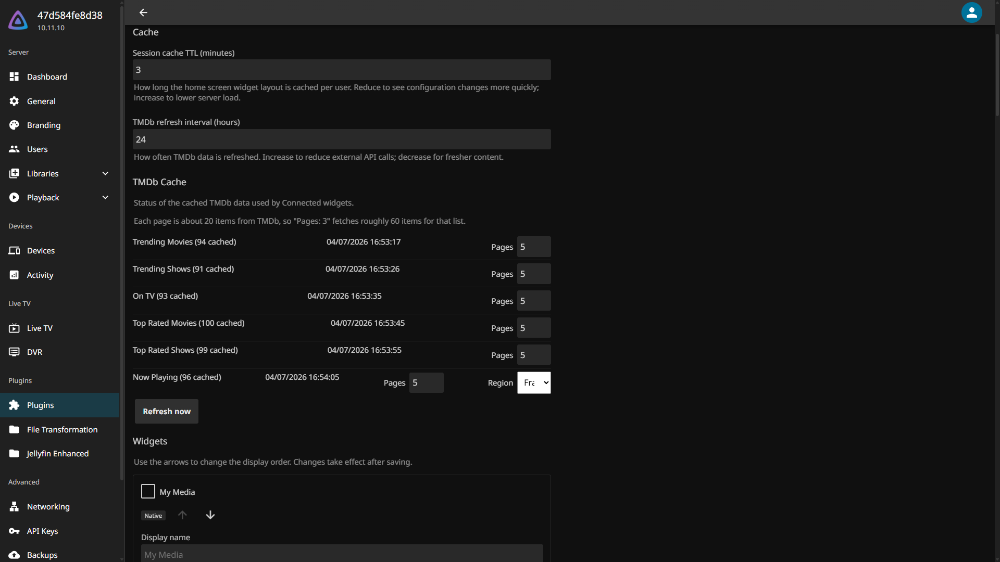

# JellyUX Homepage

<p align="center">
  
</p>

<p align="center">
  
  
  
  
</p>

A modular home screen engine for Jellyfin that replaces the default home page with a fully configurable widget system.

---

## Prerequisites

- **Jellyfin** 10.11.10 (not tested against other versions)
- **[File Transformation plugin](https://github.com/IAmParadox27/jellyfin-plugin-file-transformation)** (required - JellyUX uses it to inject its scripts into the Jellyfin web client)

---

## Installation

1. In your Jellyfin dashboard, go to **Administration > Plugins > Repositories**
2. Click **Add** and paste the following URL:
   ```
   https://raw.githubusercontent.com/Samuellct/JellyUX-Homepage/main/manifest.json
   ```
3. Go to **Administration > Plugins > Catalog**, find **JellyUX Homepage** and install it
4. Restart Jellyfin
5. Go to **Administration > Plugins > JellyUX Homepage** to configure your widgets

---

## Configuration

After installation, the plugin configuration page lets you:
- Enable or disable individual widgets
- Reorder widgets via drag and drop
- Configure per-widget parameters (minimum items, source library, etc.)

---

## Screenshots





---

## Compatibility

| Client | Status |
|---|---|
| Web browsers (Chrome, Firefox, etc.) | Supported |
| Jellyfin Media Player (Windows) | Supported |
| Jellyfin app (Android) | Supported |
| TV clients (Android TV, Apple TV, Roku) | Auto-disabled - native home screen is preserved |

---

## Synergies

JellyUX Homepage is built to coexist cleanly with other popular Jellyfin customization projects:

- **[Media Bar](https://github.com/IAmParadox27/jellyfin-plugin-media-bar)** by IAmParadox27 - adds a cinematic slideshow banner above the home screen. Both plugins patch the web client independently and render side by side without conflict.
- **[ZestyTheme](https://github.com/stpnwf/ZestyTheme)** and other CSS themes - JellyUX widgets reuse native Jellyfin CSS classes and variables instead of redefining them, so they automatically inherit whichever theme is active.

---

## Widgets

23 widgets across 4 categories, each independently enabled, reordered, and configured from the admin panel.

| Widget | Category | Description |
|---|---|---|
| Continue Watching | Native | Items you started watching but haven't finished |
| Next Up | Native | Next unwatched episode for shows you're following |
| Recently Added Movies | Native | Latest movies added to your library |
| Recently Added Shows | Native | Latest shows added to your library |
| My Media | Native | Quick links to your library sections |
| Genre | Admin | Items from a genre chosen by the admin |
| Actor | Admin | Items featuring an actor chosen by the admin |
| Director | Admin | Items directed by a person chosen by the admin |
| Studio | Admin | Items from a studio chosen by the admin |
| Collection | Admin | Items from a collection chosen by the admin |
| Tag | Admin | Items matching a tag chosen by the admin |
| Year | Admin | Items released in a year chosen by the admin |
| Because You Watched | Personalized | Recommendations based on a recently watched item |
| Favorite Genre | Personalized | Recommendations from the user's most-watched genre |
| Favorite Actor | Personalized | Recommendations from the user's most-watched actor |
| Favorite Director | Personalized | Recommendations from the user's most-watched director |
| Trending Movies | Connected (TMDb) | Movies currently trending on TMDb |
| Trending Shows | Connected (TMDb) | Shows currently trending on TMDb |
| On TV | Connected (TMDb) | Shows airing today, per TMDb |
| Top Rated Movies | Connected (TMDb) | TMDb's top-rated movies |
| Top Rated Shows | Connected (TMDb) | TMDb's top-rated shows |
| Now Playing | Connected (TMDb) | Movies currently in theaters, per TMDb |
| Discover Movies | Connected (TMDb) | Movie discovery filtered by admin-configured criteria |

---

## Troubleshooting

**Plugin becomes unreachable (HTTP 500) after an update**

A simple Jellyfin restart may not be enough after updating the plugin - do a full restart of the
Jellyfin process itself (e.g. `docker restart <container>`) to clear the File Transformation plugin's
static state.

**JellyUX sections don't appear on Jellyfin Media Player (Windows)**

Jellyfin Media Player keeps an internal auto-connect cache (`userWebClient` in
`%LOCALAPPDATA%\JellyfinMediaPlayer\jellyfinmediaplayer.conf`, `main` section) that isn't invalidated
when you switch servers in the app - it keeps loading the web client (so every plugin, not just
JellyUX) from the previously connected server, regardless of which server is currently selected.
**Recommended fix**: in the app's settings, use the **"Reset Saved Server"** button (shown
automatically whenever a server is cached). Fallback: edit `jellyfinmediaplayer.conf` and reset
`userWebClient` to an empty string. Don't confuse this with the
`%LOCALAPPDATA%\Jellyfin Media Player` cache folder (with spaces) - clearing that one does not fix
this specific issue, since it's an auto-connect cache, not a browser cache.

**"Forgot password?" button missing on the login page with ZestyTheme**

This is unrelated to JellyUX - ZestyTheme's `theme.css` intentionally hides
`.btnForgotPassword` on the login page. To use password recovery, temporarily disable the
ZestyTheme custom CSS (or remove the button's `display: none` override locally), recover the
password, then re-enable the theme.

---

## Contributing

See [CONTRIBUTING.md](CONTRIBUTING.md) for development setup, conventions, and guidelines.

---

## License

This project is licensed under the GNU General Public License v3.0. See the [LICENSE](LICENSE.md) file for details.
